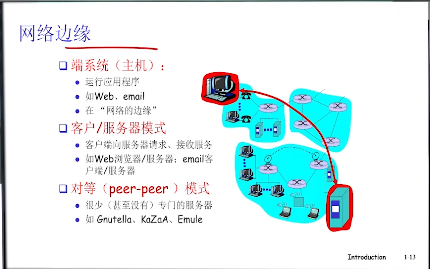

# 计网第一章

## 1. 网络核心core

1. 作用：用于互联网的数据交换
2. 实现：通过其中的各种小的链路实现（路由器，交换机等分布式系统）

## 2. 网络边缘edge

1. 作用：网络边缘上存在着应用，他们不断收发数据，是网络存在的理由
2. 实现：通过 ***接入*** 网络核心实现数据交换

     

3. 实现模式：
    

    1. 客户、服务器模式：
        1. 定义： 即所有资源在服务器，客户端请求服务器资源，服务器返回资源的模式
        2. 问题： 如果客户端过多，服务器可能会宕机。可拓展性差。
    
    2. peer to peer 模式
        1. 定义： 每个节点既是客户端也是服务器，将通信压力分散到每一个节点上

4. 实现方式：（不管什么模式都是通过基础设施由协议实现通信服务）

    1. 面向连接的交互方式： 即双方通信前先握手，同时底层服务做好准备（例如TCP协议）

        
    
    2. 无连接的交互方式： 只需要直接发送符合包的格式的数据包即可，没有TCP的流量控制，稳定性等。（一般用于实时多媒体，毕竟这样比较快）（例如UDP协议）