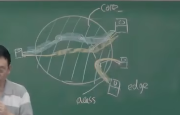
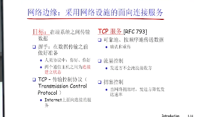

# 计网第一章

## 1. 网络核心core

1. 作用：用于互联网的数据交换

2. 实现：通过其中的各种小的链路实现（路由器，交换机等分布式系统）
    1. **电路交换**： 类似电话线，专人专线进行通信（采用了信道复用技术）
        1. 优点：资源独享，有性能保障
        2. 缺点：资源共享差，传输效率低
        3. 总结：鉴于其连接建立时间长，计算机通信有突发性（常常需要多路复用）且可靠性不高（对于大体量通信而言，采用此方法的话一旦核心被毁，波及太大），故而不适合计算机通信。
            

    2. **分组交换**： ***存储转发*** 每个节点间接收文件时完全占用链路，每个交换节点将资源完全下载后再进行转发
        1. 优点： 按需使用（需要时才占用网络资源），更灵活（有多条线路可选择），共享性
        2. 缺点： 有排队延迟和丢失（ps.计算传播时延时，接受与发送只用算一次）
        
    
3. 总结：
    

## 2. 网络边缘edge

1. 作用：网络边缘上存在着应用，他们不断收发数据，是网络存在的理由

2. 实现：通过 ***接入*** 网络核心实现数据交换

     

3. 实现模式：
    

    1. 客户、服务器模式：
        1. 定义： 即所有资源在服务器，客户端请求服务器资源，服务器返回资源的模式
        2. 问题： 如果客户端过多，服务器可能会宕机。可拓展性差。
    
    2. **peer to peer（p2p） 模式**：
        1. 定义： 每个节点既是客户端也是服务器，将通信压力分散到每一个节点上

4. 实现方式：（不管什么模式都是通过基础设施由协议实现通信服务）

    1. 面向连接的交互方式： 即双方通信前先握手，同时底层服务做好准备（例如TCP协议）

        
    
    2. 无连接的交互方式： 只需要直接发送符合包的格式的数据包即可，没有TCP的流量控制，稳定性等。（一般用于实时多媒体，毕竟这样比较快）（例如UDP协议）

## 3. 分组时延，丢失和吞吐量

1. 时延：
    1. 发送时延： 发送数据帧所用的时间
    2. 传播时延： 在信道中传播所用的时间（**计算传播时延时，接受与发送只用算一次**）
    3. 处理时延： 处理数据，查路由表等处理数据所用的时间
    4. 排队时延： 在路由器输出队列中排队等待发送所用的时间
    5. 总时延 = 发送 + 处理 + 传播 + 排队
    